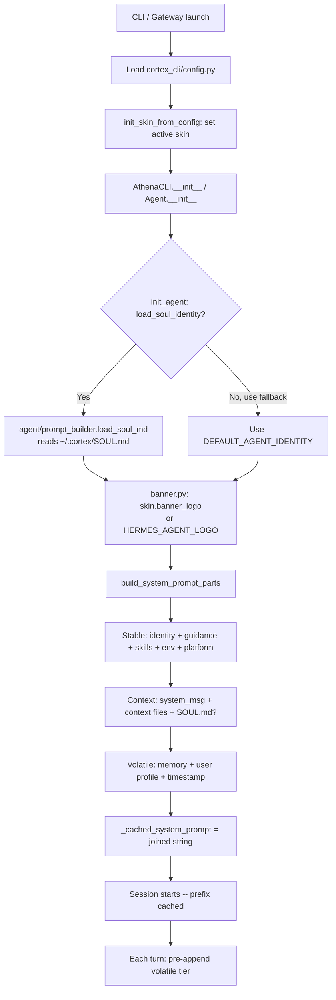

# Athena Agent — Persona Architecture

> **Purpose:** Complete reference for understanding and customising Athena Agent's
> persona system. Every layer, file, mechanism, and constraint that shapes how
> Athena presents itself — to be consumed by AI agents tasked with crafting the
> perfect Athena persona.
>
> **Repository:** `dr-shabana/athena-agent`  
> **Branch:** `main`  
> **Upstream:** `NousResearch/hermes-agent` (rebranded fork)

---

## Table of Contents

1. [Architecture Overview](#1-architecture-overview)
2. [System Prompt — Three-Tier Assembly](#2-system-prompt--three-tier-assembly)
3. [Layer 1: Agent Identity (SOUL.md)](#3-layer-1-agent-identity-soulmd)
4. [Layer 1 Fallback: DEFAULT_AGENT_IDENTITY](#4-layer-1-fallback-default_agent_identity)
5. [Layer 2: Agent Helper Guidance](#5-layer-2-agent-helper-guidance)
6. [Layer 3: Skills, Tools & Guidance Blocks](#6-layer-3-skills-tools--guidance-blocks)
7. [Layer 4: Project Context Files](#7-layer-4-project-context-files)
8. [Layer 5: Memory & User Profile](#8-layer-5-memory--user-profile)
9. [Layer 6: CLI Skin Engine](#9-layer-6-cli-skin-engine)
10. [Layer 7: Banner System](#10-layer-7-banner-system)
11. [Built-in Skin Catalogue](#11-built-in-skin-catalogue)
12. [Config Settings Affecting Persona](#12-config-settings-affecting-persona)
13. [Persona Initialisation Flow](#13-persona-initialisation-flow)
14. [Constraints & Invariants](#14-constraints--invariants)
15. [Workflow: Customising the Athena Persona](#15-workflow-customising-the-athena-persona)

---

## 1. Architecture Overview

Athena Agent's persona is **seven stacked layers**, each inherited by the one
below it. Layers are assembled at session start and **cached** — never rebuilt
mid-conversation — so upstream prefix caches stay warm across turns.

```
  ┌─────────────────────────────────────────────────────────────┐
  │                      VOLATILE (per-turn)                    │
  │  Memory snapshot · USER.md · External memory · Timestamp   │
  ├─────────────────────────────────────────────────────────────┤
  │                      CONTEXT (per-cwd)                     │
  │  .hermes.md / AGENTS.md / CLAUDE.md / .cursorrules        │
  ├─────────────────────────────────────────────────────────────┤
  │                      STABLE (per-session)                   │
  │  ┌───────────────────────────────────────────────────────┐  │
  │  │  Identity: SOUL.md or DEFAULT_AGENT_IDENTITY (fallback)│  │
  │  │  Athena-help guidance                                  │  │
  │  │  Task-completion guidance                               │  │
  │  │  Tool-use enforcement (+ per-model op. guidance)       │  │
  │  │  Skills/system prompt index                            │  │
  │  │  Environment hints                                     │  │
  │  │  Platform hints                                        │  │
  │  └───────────────────────────────────────────────────────┘  │
  └─────────────────────────────────────────────────────────────┘
  ┌─────────────────────────────────────────────────────────────┐
  │                  CLI SKIN (visual overlay)                  │
  │  Colors · Spinners · Banner ASCII art · Branding labels    │
  └─────────────────────────────────────────────────────────────┘
```

**Key files map:**

| What | File | Key Lines |
|------|------|-----------|
| Identity fallback | `agent/prompt_builder.py` | L122 `DEFAULT_AGENT_IDENTITY` |
| SOUL.md loader | `agent/prompt_builder.py` | L1472 `load_soul_md()` |
| Context file loader | `agent/prompt_builder.py` | L1592 `build_context_files_prompt()` |
| System prompt assembly | `agent/system_prompt.py` | L62 `build_system_prompt_parts()` |
| Skin engine | `cortex_cli/skin_engine.py` | L130 `SkinConfig`, L164 `_BUILTIN_SKINS` |
| Banner | `cortex_cli/banner.py` | L43 `HERMES_AGENT_LOGO` (default ASCII art) |
| Deep persona template | `docker/SOUL.md` | Template for live `~/.cortex/SOUL.md` |
| Config defaults | `cortex_cli/config.py` | L808 `DEFAULT_CONFIG` → L1388 `display:` |
| Agent initialisation | `run_agent.py` | L401 `skip_context_files`, L402 `load_soul_identity` |

---

## 2. System Prompt — Three-Tier Assembly

**File:** `agent/system_prompt.py`  
**Function:** `build_system_prompt_parts(agent, system_message=None) → Dict[str, str]`

Returns three keys joined by `\n\n` in `build_system_prompt()`:

### 2.1 Stable Tier (per-session, cached)

Identity + all guidance blocks. Loaded once at session init and **never
invalidated** except by context compression.

**Assembly order** (lines 86–321):

1. **SOUL.md (primary identity)** — if `agent.load_soul_identity` is True **or**
   `agent.skip_context_files` is False, load from `~/.cortex/SOUL.md`.
   Sets `_soul_loaded = True` when found.
2. **DEFAULT_AGENT_IDENTITY (fallback)** — only if SOUL.md was not found.
3. **HERMES_AGENT_HELP_GUIDANCE** — always present (Athena-help instructions).
4. **TASK_COMPLETION_GUIDANCE** — gated by `agent._task_completion_guidance`
   config (default True).
5. **Tool guidance blocks** — MEMORY_GUIDANCE, SESSION_SEARCH_GUIDANCE,
   SKILLS_GUIDANCE, KANBAN_GUIDANCE (gated by which tools are loaded).
6. **STEER_CHANNEL_NOTE** — mid-turn steering marker explanation (always present
   when tools exist).
7. **COMPUTER_USE_GUIDANCE** — only when `computer_use` tool is loaded.
8. **Nous Subscription prompt** — when Nous auth present.
9. **Tool-use enforcement** — per-model guidance (OPENAI_MODEL_EXECUTION_GUIDANCE
   for GPT/Codex/Grok, GOOGLE_MODEL_OPERATIONAL_GUIDANCE for Gemini/Gemma).
10. **Skills index** — `build_skills_system_prompt()` lists all active skills.
11. **Alibaba model hack** — injects correct model name for Baidu API workaround.
12. **Environment hints** — `build_environment_hints()` (WSL, Termux, etc.).
13. **Coding posture** — `coding_system_blocks()` (git/workspace snapshot).
14. **Local Python toolchain probe** — python/pip/uv/PEP-668 state.
15. **Active profile hint** — names the running profile (cross-profile guard).
16. **Platform hints** — per-platform instructions (WhatsApp, Discord, etc.).

### 2.2 Context Tier (per-session, stable per cwd)

1. **system_message** — caller-supplied (e.g. gateway session config).
2. **Context files** — `build_context_files_prompt(cwd, skip_soul=_soul_loaded)`:
   - `.hermes.md` / `HERMES.md` — walks cwd → parents → git root.
   - `AGENTS.md` / `agents.md` — cwd only.
   - `CLAUDE.md` / `claude.md` — cwd only.
   - `.cursorrules` — cwd only.
   - `.cursor/rules/*.mdc` — cwd only.
   - Each source capped at **20,000 chars** (70% head / 20% tail / 10% truncation
     marker).
   - If SOUL.md was already loaded as identity, `skip_soul=True` prevents
     dual-injection.

### 2.3 Volatile Tier (per-turn, never cached)

1. **Memory snapshot** — `agent._memory_store.format_for_system_prompt("memory")`.
2. **User profile** — `agent._memory_store.format_for_system_prompt("user")`.
3. **External memory provider** — if `agent._memory_manager` exists.
4. **Timestamp line** — date-only (not minute-precision) to preserve KV cache.
   Format: `"Conversation started: Saturday, June 13, 2026"`.
   + Session ID, Model, Provider when available.

### Caching Rules

- `build_system_prompt()` → `agent._cached_system_prompt` — cached for the
  entire session.
- Only `invalidate_system_prompt()` (called on context compression) clears it.
- The volatile tier is appended at API-call time, NOT part of the cached block.

---

## 3. Layer 1: Agent Identity (SOUL.md)

**File:** `agent/prompt_builder.py` L1472–1497 (`load_soul_md()`)  
**Location:** `~/.cortex/SOUL.md`

### Loading Behaviour

```
def load_soul_md() -> Optional[str]:
    1. Ensure CORTEX_HOME exists (call ensure_cortex_home()).
    2. Check CORTEX_HOME / "SOUL.md" exists → if not, return None.
    3. Read content, strip whitespace → if empty, return None.
    4. Run _scan_context_content() — injection/threat scan.
    5. Run _truncate_content() — 20K char limit.
    6. Return content (raw Markdown string).
```

### Format Guidelines

SOUL.md is **raw Markdown** loaded verbatim into the first slot of the system
prompt. In the reference `docker/SOUL.md`:

```markdown
# Athena Agent Persona

<!--
This file defines the agent's personality and tone.
The agent will embody whatever you write here.
Edit this to customize how Athena communicates with you.

Examples:
  - "You are a warm, playful assistant who uses kaomoji occasionally."
  - "You are a concise technical expert. No fluff, just facts."
  - "You speak like a friendly coworker who happens to know everything."

This file is loaded fresh each message -- no restart needed.
Delete the contents (or this file) to use the default personality.
-->
```

### Security Scanning

`_scan_context_content()` runs regex-based injection detection
(`_scan_for_threats()`) on every context file. If threats are found, the content
is **blocked** and replaced with a `[BLOCKED: ...]` message — it never reaches
the system prompt.

---

## 4. Layer 1 Fallback: DEFAULT_AGENT_IDENTITY

**File:** `agent/prompt_builder.py` L122–130

When no `~/.cortex/SOUL.md` exists, this hardcoded identity is used:

```python
DEFAULT_AGENT_IDENTITY = (
    "You are Athena Agent, an intelligent AI assistant created by Nous Research. "
    "You are helpful, knowledgeable, and direct. You assist users with a wide "
    "range of tasks including answering questions, writing and editing code, "
    "analyzing information, creative work, and executing actions via your tools. "
    "You communicate clearly, admit uncertainty when appropriate, and prioritize "
    "being genuinely useful over being verbose unless otherwise directed below. "
    "Be targeted and efficient in your exploration and investigations."
)
```

**Key insight:** This is the **fallback**. If SOUL.md exists, this string
never enters the system prompt on its own — it is **completely replaced**. To
change Athena's core identity, you **must** create/modify `~/.cortex/SOUL.md`.

---

## 5. Layer 2: Agent Helper Guidance

**File:** `agent/prompt_builder.py` L132–141

Always present, always after the identity block:

```python
HERMES_AGENT_HELP_GUIDANCE = (
    "You run on Athena Agent (by Nous Research). When the user needs help with "
    "Athena itself — configuring, setting up, using, extending, or troubleshooting "
    "it — or when you need to understand your own features, tools, or capabilities, "
    "the documentation at https://athena-agent.nousresearch.com/docs is your "
    "authoritative reference ..."
)
```

**Note:** This text names the agent as "Athena Agent (by Nous Research)" and
links to `athena-agent.nousresearch.com`. If the persona needs a different name
or different documentation URL, this **must** be edited.

---

## 6. Layer 3: Skills, Tools & Guidance Blocks

**File:** `agent/prompt_builder.py`

These blocks are independent of the persona identity but **cannot be removed** —
they are core behavioural guardrails:

| Block | Control | Location |
|-------|---------|----------|
| TASK_COMPLETION_GUIDANCE | "finishing the job" + no-fabrication | L292–305 |
| MEMORY_GUIDANCE | Memory tool usage rules | L143–165 |
| SESSION_SEARCH_GUIDANCE | Past session search instructions | L167–202 |
| SKILLS_GUIDANCE | Skill tool usage rules | L204–249 |
| KANBAN_GUIDANCE | Kanban worker lifecycle | L275–290 |
| STEER_CHANNEL_NOTE | Mid-turn user steering trust marker | L461–472 |
| OPENAI_MODEL_EXECUTION_GUIDANCE | GPT/Codex/Grok execution discipline | L315+ |
| GOOGLE_MODEL_OPERATIONAL_GUIDANCE | Gemini/Gemma guidance | L315+ |
| COMPUTER_USE_GUIDANCE | macOS background control | L400–440 |
| TOOL_USE_ENFORCEMENT_GUIDANCE | "Actually call tools" enforcement | (near L160) |

**Important for persona crafting:** These blocks form the **container** around
the persona. The persona's identity text is injected **before** all of them, so
the persona can (and should) reference or override behaviours by saying "You are
X, and here's how you handle Y" — but it must not contradict the hard guidance
below it.

---

## 7. Layer 4: Project Context Files

**File:** `agent/prompt_builder.py` L1592–1624 (`build_context_files_prompt()`)

Loaded **after** identity and guidance — placed in the context tier. These allow
per-project persona adjustments:

| File | Search Scope | Typical Use |
|------|-------------|-------------|
| `.hermes.md` / `HERMES.md` | cwd → parents → git root | Project-level agent instructions |
| `AGENTS.md` | cwd only | Cursor/Cline-style persona file |
| `CLAUDE.md` | cwd only | Claude Code-style persona file |
| `.cursorrules` | cwd only | Cursor Pro-style rules |
| `.cursor/rules/*.mdc` | cwd only | Cursor rule files |
| `SOUL.md` (in context tier) | `~/.cortex/` only | Always from CORTEX_HOME; skipped when already identity |

**Max char per file:** 20,000 (70/20 head/tail/truncate).

---

## 8. Layer 5: Memory & User Profile

**File:** `agent/system_prompt.py` L343–361

- **Memory (memory store):** Injected when `agent._memory_enabled` is True.
  Renders the `memory` store (`MEMORY.md` — agent's persistent notes).
- **User profile (USER.md):** Injected when `agent._user_profile_enabled` is
  True. Renders the `user` store (user's personal facts).

Both are formatted by `agent._memory_store.format_for_system_prompt(scope)` and
placed in the volatile tier.

---

## 9. Layer 6: CLI Skin Engine

**File:** `cortex_cli/skin_engine.py`

### SkinConfig Dataclass (L130–157)

```python
@dataclass
class SkinConfig:
    name: str
    description: str = ""
    colors: Dict[str, str] = field(default_factory=dict)    # ~30 color keys
    spinner: Dict[str, Any] = field(default_factory=dict)   # waiting_faces, thinking_faces, thinking_verbs, wings
    branding: Dict[str, str] = field(default_factory=dict)  # agent_name, welcome, goodbye, response_label, prompt_symbol, help_header
    tool_prefix: str = "┊"                                   # Prefix for tool call display
    tool_emojis: Dict[str, str] = field(default_factory=dict)  # Per-tool emoji overrides
    banner_logo: str = ""     # Rich-markup ASCII art logo (replaces HERMES_AGENT_LOGO)
    banner_hero: str = ""     # Rich-markup hero art (replaces HERMES_CADUCEUS)
```

### Loading Order

```
load_skin(name):
    1. Check ~/.cortex/skins/<name>.yaml  →  parse YAML  →  SkinConfig
    2. If not found, check _BUILTIN_SKINS[name]  →  SkinConfig
    3. If not found, fallback to _BUILTIN_SKINS["default"]
```

Built-in skins are Python dicts in `_BUILTIN_SKINS` (L164+). User skins live
as YAML files in `~/.cortex/skins/<name>.yaml`. Inheritance: user skin colors
are **merged over** the default skin's colors (so you can override just the
hues you want to change).

### Color Keys

The `colors` dict has mandatory keys used throughout the CLI/display code:

| Color Key | Purpose |
|-----------|---------|
| `banner_border` | Frame border around the startup banner |
| `banner_title` | Title text in the startup banner |
| `banner_accent` | Accent highlights in banner |
| `banner_dim` | Dim/subtle banner elements |
| `banner_text` | Body text in the banner |
| `ui_accent` | General UI accent (selection, focus) |
| `ui_label` | Label text colour |
| `ui_ok` | Success/OK colour |
| `ui_error` | Error colour |
| `ui_warn` | Warning colour |
| `prompt` | Input prompt symbol colour |
| `input_rule` | Input field rule/separator colour |
| `response_border` | Response box border colour |
| `session_label` | Session header label colour |
| `session_border` | Session list border colour |
| `status_bar_bg` | Status bar background |
| `status_bar_text` | Status bar text |
| `status_bar_strong` | Status bar highlight |
| `status_bar_dim` | Status bar low-priority text |
| `status_bar_good` | Status bar success segment |
| `status_bar_warn` | Status bar warning segment |
| `status_bar_bad` | Status bar error segment |
| `status_bar_critical` | Status bar critical segment |

### Branding Keys

| Key | Example | Purpose |
|-----|---------|---------|
| `agent_name` | `"Athena Agent"` | Agent display name |
| `welcome` | `"Welcome to Athena Agent! ..."` | First-run welcome message |
| `goodbye` | `"Goodbye! ⚕"` | Exit message |
| `response_label` | `" ⚕ Athena "` | Label shown before responses |
| `prompt_symbol` | `"❯"` | Interactive prompt symbol |
| `help_header` | `"(^_^)? Available Commands"` | Header for help output |

### Spinner / Thinking State

| Key | Type | Example |
|-----|------|---------|
| `waiting_faces` | List[str] | `["(≈)", "(Ψ)", "…"]` — shown during waiting |
| `thinking_faces` | List[str] | `["(Ψ)", "(∿)", "…"]` — shown during thinking |
| `thinking_verbs` | List[str] | `["charting currents", "sounding the depth"]` |
| `wings` | List[List[str]] | `[["⟪≈", "≈⟫"], …]` — animated wings |

### User Skin YAML Format

```yaml
name: my-custom-skin
description: "My custom skin description"

colors:
  banner_border: "#4169e1"
  banner_title: "#7eb8f6"
  # ... only override what you need, rest inherits from default

spinner:
  waiting_faces: ["(≈)", "(Ψ)", "(∿)"]
  thinking_faces: ["(Ψ)", "(∿)", "(≈)"]
  thinking_verbs:
    - "my custom verb"
    - "another verb"

branding:
  agent_name: "My Agent"
  welcome: "Welcome to My Agent!"
  goodbye: "Goodbye!"
  response_label: " ❯ My Agent "
  prompt_symbol: "❯"
  help_header: "[?] Help"

tool_prefix: "│"
banner_logo: "[bold #FFD700]...ASCII ART...[/]"
banner_hero: "[#4169e1]...ASCII ART...[/]"
```

### Initialisation

```python
def init_skin_from_config(config: dict) -> None:
    display = config.get("display") or {}
    skin_name = display.get("skin", "default")
    set_active_skin(skin_name.strip())
```

Called once at CLI startup from `cortex_cli/config.py`.

---

## 10. Layer 7: Banner System

**File:** `cortex_cli/banner.py`

The banner is the **visual identity** users see on launch. It has two
components:

### 10.1 Default Logo (`HERMES_AGENT_LOGO`)

Located at L43 in `banner.py`. This is the large ASCII art logo shown at the
top of the startup banner. Currently shows a Hermes winged-staff + "ATHENA"
lettering in gold #FFD700.

### 10.2 Default Hero Art (`HERMES_CADUCEUS`)

A smaller ASCII art decorative element shown below the logo.

### 10.3 Skin Override Mechanism

When a skin defines `banner_logo` or `banner_hero`, the skin's version
**replaces** the defaults. The banner assembly code checks:

```python
_skin = get_active_skin()
logo = _skin.get_branding("banner_logo", HERMES_AGENT_LOGO)  # still uses this method
# Actually: the skin's banner_logo field is checked in the display builder
```

**Important:** The skin's `banner_logo` and `banner_hero` are Rich-markup
strings (Rich Text Markup Language), not plain ASCII. They use Rich markup like
`[bold #FFD700]...[/]` and `[#HEXCOLOR]...[/]` for colour rendering.

---

## 11. Built-in Skin Catalogue

**File:** `cortex_cli/skin_engine.py` L164–649

| Skin Name | Theme | Agent Name | Description |
|-----------|-------|------------|-------------|
| `default` | Gold/kawaii | Athena Agent | Classic — gold & bronze |
| `ares` | War-god | Ares Agent | Crimson & bronze |
| `mono` | Monochrome | Athena Agent | Clean grayscale (*no banner art*) |
| `slate` | Developer | Athena Agent | Cool blue suite |
| `daylight` | Light mode | Athena Agent | Bright terminal with dark text |
| `warm-lightmode` | Warm light | Athena Agent | Brown/gold for light backgrounds |
| `poseidon` | Ocean-god | Poseidon Agent | Deep blue & seafoam |
| `sisyphus` | Sisyphean | Sisyphus Agent | Austere grayscale |
| `charizard` | Volcanic | Charizard Agent | Burnt orange & ember |

Each skin has its own:
- Colors (unique palette)
- Spinner (faces, verbs, wings unique to the theme)
- Branding labels (custom agent name, welcome, goodbye)
- Banner logo + hero art (unless inheriting default)

**Important for persona:** Every skin except `mono` comes with a distinct
persona-in-a-box — `ares` is a war god, `poseidon` is an ocean god, `sisyphus`
is a persistence philosopher, `charizard` is a fire creature. When the skin's
`agent_name` differs from "Athena Agent", the whole CLI experience shifts to
that identity (welcome message, goodbye message, prompt symbol, etc.).

---

## 12. Config Settings Affecting Persona

**File:** `cortex_cli/config.py` L808+ (`DEFAULT_CONFIG`)

| Config Key | Default | Effect |
|------------|---------|--------|
| `display.skin` | `"default"` | Active skin name |
| `display.personality` | `""` | Currently unused (placeholder) |
| `display.compact` | `False` | Compact display mode |
| `agent.tool_use_enforcement` | `"auto"` | Model-specific tool guidance |
| `agent.task_completion_guidance` | `True` | Inject finishing-the-job block |
| `agent.coding_context` | `"auto"` | Coding posture (adds to prompt) |
| `agent.environment_hint` | `""` | Custom env description appended |
| `gateway.ephemeral_system_prompt` | — | Injected at call-time (not cached) |

---

## 13. Persona Initialisation Flow



---

## 14. Constraints & Invariants

### Prompt Caching (Critical)

The entire stable + context tier is **cached** for the session. Only
`invalidate_system_prompt()` (from context compression) rebuilds it. This means:

- **DO NOT** rely on dynamic runtime state in SOUL.md or guidance blocks.
- **DO NOT** put time-sensitive instructions in the stable tier.
- The volatile tier (timestamp, memory) is appended at each API call, so it
  CAN change.

### SOUL.md vs DEFAULT_AGENT_IDENTITY

- SOUL.md is the **primary** source. DEFAULT_AGENT_IDENTITY is the **fallback**.
- If SOUL.md is found, DEFAULT_AGENT_IDENTITY is **never** injected (not even as
  a supplement — it's entirely replaced).
- The persona in SOUL.md should be **self-contained** — covering identity,
  tone, behaviour, communication style. It must not rely on the default text.

### Security

- All context files (SOUL.md, AGENTS.md, .hermes.md, .cursorrules) are
  **threat-scanned** via `_scan_context_content()`.
- Injection markers are detected and content is replaced with `[BLOCKED]`.
- The SOUL.md that defines the persona must pass this scan.

### Skin Limitations

- The skin system controls **CLI display only** (banner, prompt, response box,
  status bar, spinners).
- The skin does **not** affect the system prompt or agent behaviour (except
  through branding labels that appear in the UI).
- The skin's `agent_name` branding field affects welcome/goodbye/response labels
  but does NOT change the agent's identity in the system prompt.

### Platform Channels

- Platform hints (WhatsApp, Discord, Telegram, etc.) are injected into the
  stable tier after persona identity — they may contradict persona voice rules
  if not coordinated.
- `display.personality` exists in config but is currently **unused** by the
  system prompt assembly. It is a placeholder.

---

## 15. Workflow: Customising the Athena Persona

### Option A: Full Persona (Recommended)

1. **Create `~/.cortex/SOUL.md`** — The full identity text: who Athena is,
   her voice, tone, behavioural rules, response style, domain expertise.
2. **Design a custom skin** — Create `~/.cortex/skins/athena-goddess.yaml`
   with matching colors, brand labels, banner art, and spinner verbs that
   complement the SOUL.md persona.
3. **Set config** — `display.skin: "athena-goddess"` in `config.yaml`.
4. *(Optional)* **Create a `AGENTS.md`** in the working directory if the
   persona needs project-specific behaviour adjustments.
5. *(Optional)* **Edit `HERMES_AGENT_HELP_GUIDANCE`** in `prompt_builder.py`
   if the documentation URL or agent name should differ from the default.

### What Each Layer Controls

| Layer | Controls | Format |
|-------|----------|--------|
| `SOUL.md` | Core identity, voice, behavioural rules | Plain Markdown |
| `Skin (YAML)` | Visual identity: colors, banner art, prompt symbol | YAML + Rich markup |
| `DEFAULT_AGENT_IDENTITY` | Fallback identity (edit only if SOUL.md not used) | Python string |
| `HERMES_AGENT_HELP_GUIDANCE` | "I run on Athena Agent" doc link | Python string |
| `AGENTS.md` | Per-project persona tweaks | Markdown |
| `memory (USER.md)` | Long-term user/agent facts | Managed via memory tool |

### Verification Checklist

After persona changes, confirm:

- [ ] `athena` launches with the correct banner/logo
- [ ] Prompt symbol matches the skin specification
- [ ] Response label reads the expected name (e.g., `⚕ Athena >`)
- [ ] Welcome/goodbye messages use the new branded text
- [ ] `~/.cortex/SOUL.md` is loaded (check by asking "who are you?")
- [ ] No security scan blocks the SOUL.md content
- [ ] Skin colors render correctly in the terminal
- [ ] Spinner faces and verbs reflect the new persona
- [ ] The banner artwork matches the expected theme
- [ ] Documentation URL (if customised) resolves correctly

---

> **Document version:** 1.0  
> **Last updated:** June 13, 2026  
> **Audience:** AI agents tasked with crafting Athena's perfect persona
